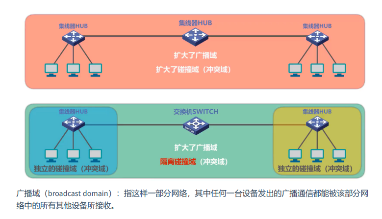
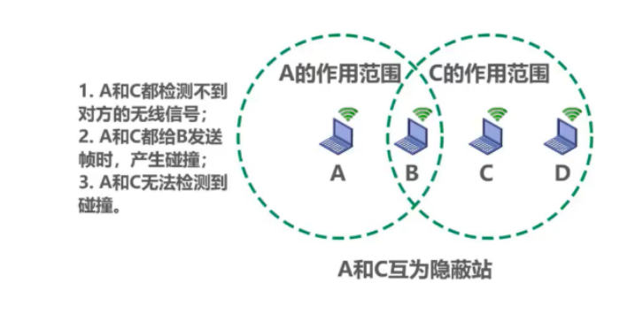
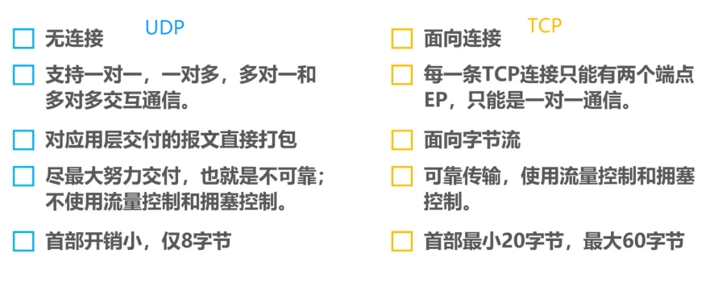

[TOC]

# L0 散落知识点

## 各层概述

| 分层       | PDU    | 功能/任务                                    | 备注         |
| ---------- | ------ | -------------------------------------------- | ------------ |
| 物理层     | 比特   | 在物理媒体上为数据端设备透明地传输比特流     |              |
| 数据链路层 | 帧     | 封装成帧、透明传输、差错检测                 |              |
| 网络层     | 分组   | 实现网络互连，进而实现数据包在各网络之间传输 | IP/ICMP/ARP  |
| 运输层     | 数据段 | 为端到端连接提供可靠传输服务                 | TCP/UDP      |
| 应用层     | 数据   |                                              | HTTP/DNS/FTP |

## 关于 k

- 数据传输中 1k=1000
- 数据块/容量中 1k=1024

## 各种协议的端口和传输方式

| 名称            | 端口    | 传输方式 |
| --------------- | ------- | -------- |
| **DNS**         | **53**  | **UDP**  |
| FTP 控制连接    | 21      | TCP      |
| FTP 数据连接    | 20      | TCP      |
| HTTP            | 80      | TCP      |
| POP3            | 110     | TCP      |
| IMAP            | 143     | TCP      |
| SMTP            | 25      | TCP      |
| **DHCP 客户**   | **68**  | **UDP**  |
| **DHCP 服务器** | **67**  | **UDP**  |
| BGP             | 179     | TCP      |
| **RIP**         | **520** | **UDP**  |

## 集线器、中继器、交换器、路由器

广播域：指这样一部分网络，其中任何一台设备发出的广播通信都能被这个网络中的其他设备接受接收

|                | 集线器 | 中继器 |   交换器   | 路由器 |
| :------------: | :----: | :----: | :--------: | :----: |
|     工作层     | 物理层 | 物理层 | 数据链路层 | 网络层 |
| 是否隔离冲突域 |   0    |   0    |     1      |   1    |
| 是否隔离广播域 |   0    |   0    |     0      |   1    |

## 时延的计算

- 从 A 开始发送到 B 完全收到，用时是 1 个传播时延 +1 个发送时延（不是 2 个），类似于火车过桥问题

# L1 物理层

## 主要任务

* 机械特性：指明接口所用接线器的形状和尺寸、引线数目和排列、固定和锁定装置等等。
* 电气特性：指明在接口电缆的各条线上出现的电压的范围。
* 功能特性：指明某条线上出现的某一电平的电压表示何种意义。
* 过程特性：指明对于不同功能的各种可能事件的出现顺序。 

## 香农和奈氏公式

- 奈奎斯特准则。理想低通信道下极限数据传输率：

$$
v=2W\log_2V
$$

- 香农公式。信道的极限数据传输率：

$$
v=W\log_2(1+\frac {S}{N})
$$

- $W$ 是信道带宽，$\frac{S}{N}$ 是功率比，化为分贝是 10 倍的自然对数
- 两者均对数据传输率做了限制，实际中应取较低的限制

## 编码方式

## 电路交换、分组交换、报文交换

## 复用技术

码分复用：
$$
S·T=\frac{1}{m}\sum_{i=1}^{m}{S_iT_i}=0
$$

# L2 数据链路层

数据链路层三个重要问题：封装成帧、差错检测、可靠传输

## CSMA/CD 协议

- 含义：多点接入、载波监听、差错检测
- 最小帧长：

$$
2\tau·数据传输速率
$$

- $2\tau$：争用期/碰撞窗口

- **检测到碰撞后，需要等待 $\tau$ 时间使信道清空**

- 截断二进制指数退避算法
  - $k=Min\{重传次数,10\}$
  - 从集合 $\{0,1,2……（2^k-1）\}$ 中选取随机数 r
  - 等待 $2 \tau·r$ 时间后重传
  - 重传时间结束后，等待帧间最小间隔后正常发送
  - 重传次数=16 时，丢弃帧，并向高层报告
- 信道极限利用率:

$$
S_{max}=\frac{T_0}{T_0+\tau}
$$

## CSMA/CA 协议

无线局域网不使用碰撞检测 CD：

- 接收强度远小于发送强度，对硬件的要求特别高
- 无线电传播存在隐蔽站问题

## CRC 校验

## ARP（网络层协议）

整个过程类似于“从群聊中找某人私聊”，ARP 请求报文被封装在 MAC 帧中

- 主机 A 的 ARP 进程在本局域网**广播**发送一个 ARP 请求分组：“我的 IP 地址是 IP1，MAC 地址是 MAC1，我想知道 IP 地址是 IP2 的主机的 MAC 地址”
- ARP 请求报文的目的 MAC 地址为：FF-FF-FF-FF-FF-FF
- 本局域网上所有主机的 ARP 进程都收到此 ARP 请求分组
- 主机 B 的 ARP 进程发现 IP2 正是自己的 IP 地址，于是收下这个帧，并发送一个单播帧：“我的 IP 地址是 IP2，我的 MAC 地址是MAC2 ”
- 主机 A 收到这个帧后，在其 ARP 高速缓存中写入这个 IP2 到 MAC2 的映射

ARP 的使用是**逐段进行**的

## 交换机的自学习

- 收到该帧后进行登记，登记帧的源 MAC 地址和交换机接口之间的映射
- 根据目的 MAC 地址和交换表进行转发，有三种情况：
  - 明确转发：交换机明确知道从哪个（或哪些）接口转发
  - 盲目转发：交换机不知道从哪个（或哪些）接口转发，则转发给除了进入接口之外的全部接口（洪泛）
  - 明确丢弃：交换机知道不应该转发该帧

# L3 网络层

## 路由选择协议

### RIP

- 路由表更新原则

| 情况                       | 操作                       |
| -------------------------- | -------------------------- |
| 出现新网络                 | 更新                       |
| ***相同下一跳***           | ***更新（即使路由变长）*** |
| 不同下一跳，新路由优势     | 更新                       |
| 不同下一跳，新路由劣势     | 不更新                     |
| **不同下一跳，新路由相等** | **什么也不做**             |

- 路由器到直连网络的距离为 1，每增加一个路由器，距离加 1
- 一条路径最多包含 15 个路由器，距离为 16 时相当于不可达（无穷大）
- “坏消息传得慢”

### OSPF

- Dijkstra 提出的最短路径算法 SPF。
- 向本自治系统中的所有路由器发送信息，这种方法是洪泛法。
- 发送的信息就是与相邻路由器的链路状态，链路状态包括与哪些路由器相连以及链路的度量。
- 所有路由器都具有全网的拓扑结构图，并且是一致的，更新过程收敛的很快。

### BGP

- eBGP 和 iBGP 不是两个不同的协议，前者是不同 AS 的 BGP 连接，后者是同一 AS 的 BGP 连接
- 路径向量包含自身在内，不能选择这条路径，否则会兜圈子
- 每个 AS 内部所有的 iBGP 必须是全连通的，即使两个路由器之间没有物理连接，也要有 iBGP 连接

## IP 数据报的格式 & 分片

- 首部长度（单位：4 字节）: 占 4 位，因此最大值为 15。值为 1 表示的是 1 个 4 字节。最小值为 0101，最大值 1111。如果可选字段的长度不是 4 字节的整数倍，就用尾部的填充部分（全0）来填充。
- 总长度（单位：1 字节）：占 16 位，包括首部长度和数据载荷长度，理论上数据报上限长度为 65535 字节，但往往达不到。
- 标识：占 16 位，IP 软件每产生一个数据报，就将序号加 1 后赋给标识。相同的标识字段使分片后的各数据报片正确重组。
- 标志：占 3 位，只有前两位有意义
  - 最低位为 MF（More Fragment）：1 表示后面还有分片，0 表示这是最后一个分片
  - 中间位为 DF（Don' t Fragment）：为 0 时才可以分片
- 片偏移（单位：8 字节）：占 13 位，较长的分组在分片后，某片在原分组中的相对位置
- 首部检验和：**只检验首部信息，不包括数据载荷部分**

***除最后一个分片外，其余分片的数据载荷一定要是 8 字节的整数倍***

## ICMP

- ICMP：网际控制报文协议
- 两种 ICMP 报文：ICMP 差错报告报文和 ICMP 询问报文
- 两种应用：PING 和 traceroute
- 路由器先收下数据报，再将 TTL 减一，再判断减一后的 TTL 是否为 0，很巧妙

## VPN & NAT

## 路由表

默认路由：0.0.0.0/0

# L4 运输层

## 运输层的端口

* 软件端口与硬件端口
  * 在协议栈层间的抽象的协议端口是软件端口
  * 路由器或交换机上的端口是硬件端口
* 三类端口
  * 熟知端口，数值一般为 0~1023
  * 登记端口号，数值为1024~49151，为没有熟知端口号的应用程序使用的。使用这个范围的端口号必须在 IANA 登记，以防止重复
  * 客户端口号或短暂端口号，数值为49152~65535，留给客户进程选择暂时使用。当服务器进程收到客户进程的报文时，就知道了客户进程所使用的动态端口号。通信结束后，这个端口号可供其他客户进程以后使用

## TCP 与 UDP 比较

## UDP 首部格式

- 长度：以字节为单位，包括首部长度和数据载荷长度，最小为8（只有首部）
- 检验和：增加12字节的伪首部后，把首部和数据载荷一起检验

## TCP 首部格式

- 序号：本 TCP 报文段数据载荷部分第一个字节的序号
- 确认号：期望对方下一个 TCP 报文段数据载荷部分的第一个字节的序号；若确认号为 N，证明前（N-1）个字节全部收到

- 校验和：检查范围包括 TCP 报文段的**首部和数据载荷**两部分
- 数据偏移（首部长度）：占 4 位，因此最大值为 15。值为 1 表示的是 1 个 4 字节。最小值为 0101，最大值 1111。如果可选字段的长度不是 4 字节的整数倍，就用尾部的填充部分（全0）来填充。

## 三报文握手

- SYN=1 的报文段不能携带数据，但要消耗一个序号
- 普通 TCP 报文段若不携带数据，不消耗序号

## 四报文挥手

- FIN=1 的报文段不携带数据，也要消耗一个序号

## 拥塞控制

# L5 应用层

## HTTP

- 请求一个万维网**文档**所需的时间是文档的传输时间（与文档大小有关）+ $2RTT$ 
- 若有图片等其他内容，时间另算
- 请求报文不是最早的那个报文

## DNS

- 端口号53
- 递归和迭代相结合，如下图

## FTP

- 控制连接端口号 21
- 数据连接端口号 20
- 控制连接在整个会话期间保持打开状态
- 两种模式：主动模式和被动模式

## 电子邮件

- SMTP 端口号 25
- POP3 端口号 110
- IMAP 端口号 143

* POP3
  * POP3 的特点是只要用户从服务器上读取了邮件，就把该邮件删除。但最新版本的 POP3 可以不删除邮件。
* IMAP
  * IMAP 协议中客户端和服务器上的邮件保持同步，如果不手动删除邮件，那么服务器上的邮件也不会被删除。IMAP 这种做法可以让用户**随时随地去访问服务器上的邮件**。

## DHCP

- 使用 DHCP 中继代理是因为我们不用给每一个网络上都设置一个 DHCP 服务器，这样会使 DHCP 服务器的数量太多

# 常考过程

## 访问网站的过程

1. 浏览器分析链接指向页面的 URL
2. 浏览器向 DNS 请求解析 www.baidu.com 的 IP 地址
3. DNS 解析出 IP 地址
4. 浏览器与该服务器建立 TCP 连接（默认端口号80）
5. 浏览器发出 HTTP 请求
6. 服务器通过 HTTP 相应把 HTML 文件发给浏览器
7. 释放 TCP 连接
8. 浏览器解释 HTML 文件，将 Web 页面展示给用户

## DNS 解析的过程

（假设客户想获知 y.abc.com 的 IP 地址）（以下是 8 个 UDP 报文）

1. 客户机向本地域名服务器发出 DNS 请求报文
2. 本地域名服务器收到请求后，查询本地缓存，若有该记录，直接发送给客户机；若没有，则以 DNS 客户的身份向根域名服务器发出解析请求报文
3. 根域名服务器收到请求后，判断该域名属于 .com 域，将对应的顶级域名服务器 dns.com 的 IP 地址返回给本地域名服务器
4. 本地域名服务器向顶级域名服务器 dns.com 发出解析请求报文
5. 顶级域名服务器收到请求后，判断该域名属于 abc.com 域，将对应的顶级域名服务器 dns.abc.com 的 IP 地址返回给本地域名服务器
6. 本地域名服务器向二级域名服务器 abc.dns.com 发出解析请求报文
7. 二级域名服务器收到请求后，将查询结果的 IP 地址返回给本地域名服务器
8. 本地域名服务器将结果保存到本地缓存，同时返回给客户机

## FTP 工作过程

（假设客户想下载文件 ftp://ftp.abc.edu.cn/file.doc）

1. DNS 解析 ftp.abc.edu.cn 对应的 IP 地址
2. 服务器监听端口号 21，客户选择一个随机端口 1，向服务器请求建立控制连接
3. 开始传送数据之前，客户打开另一个随机端口 2，通过控制连接告知服务器，请求建立数据连接
4. 服务器用端口号 20 与客户的随机端口 2 建立数据连接
5. 使用 TCP 传送文件
6. 关闭数据连接
7. 关闭控制连接

## 电子邮件的收发过程

1. 发信人使用用户代理编辑要发送的邮件。用户代理用 SMTP 把邮件传送给发送端邮件服务器
2. 发送端邮件服务器将邮件放入邮件缓存队列中，等待发送
3. 运行在发送端邮件的 SMTP 客户进程，发现缓存中有待发送的邮件，就向接收服务器的 SMTP 进程发起建立 TCP 连接
4. SMTP 客户进程向远程 SMTP 进程发送邮件，发送结束后关闭 TCP 连接
5. 接收端服务器的 SMTP 进程收到邮件后，将邮件放入收信人的用户邮箱，等待读取
6. 收信人调用用户代理，使用 POP3 或 IMAP 协议将邮件从接收端服务器取出
